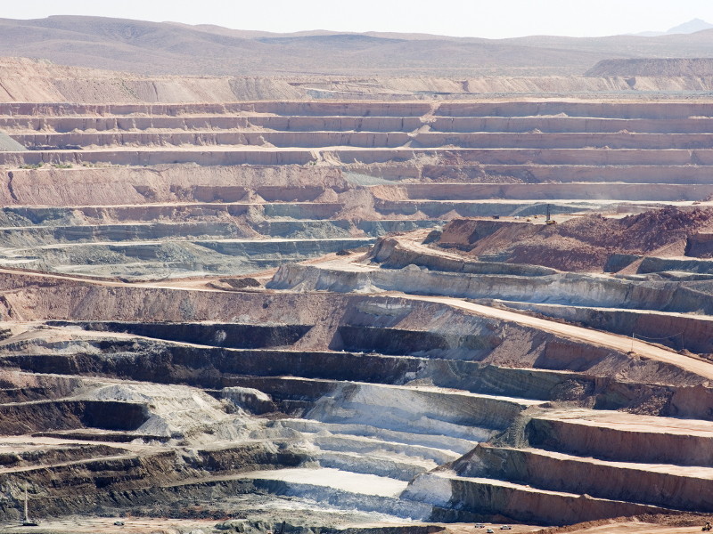

# Time-Series-Classification-Seismic-Dataset
An open source dataset for time series classification on seismic time series. 

From: https://www.timeseriesclassification.com/description.php?Dataset=Earthquakes

* The earthquake classification problem involves predicting whether a major event is about to occur based on the most recent readings in the surrounding area.

* The data is taken from Northern California Earthquake Data Center and **each data is an averaged reading for one hour**, with the first reading taken on Dec 1st 1967, the last in 2003. 

* We transform this single time series into a classification problem by first defining a major event as any reading of over 5 on the Rictor scale. 

*  Major events are often followed by aftershocks. The physics of these are well understood and their detection is not the objective of this exercise. 

* Hence we consider a positive case to be one where a major event is not preceded by another major event for at least 512 hours.    
   

* To construct a negative case, we consider instances where there is a reading below 4 (to avoid blurring of the boundaries between major and non major events) that is preceded by at least 20 readings in the previous 512 hours that are non-zero (to avoid trivial negative cases). 

* None of the cases overlap in time (i.e. we perform a segmentation rather than use a sliding window).

* Of the 86,066 hourly readings, we produce 368 negative cases and 93 positive. (368 + 93 = 461).

* 512/24 = 21.333333333333332

## 10/22/2023

https://www.caltech.edu/about/news/california-supervolcano-is-cooling-off-but-may-still-cause-quakes

--

Useful approaches here:

https://github.com/mlr7/Time-Series-Classification-for-Exoplanet-Discovery

--

(Idea: Cluster in Lat-Lon, and/or Lat-Lon-Time, to get seismic clusters, and seq-analysis from there . . . ) (and deep viz)

### ST-DBSCAN

ST-DBSCAN (Spatial-Temporal Density-Based Spatial Clustering of Applications with Noise) is an extension of the popular DBSCAN clustering algorithm, which is designed specifically for clustering spatial-temporal data. Here's a brief overview of the ST-DBSCAN algorithm:

Spatial-Temporal Data: This type of data has both spatial and temporal attributes. For example, the location and time of a taxi trip or the coordinates and timestamp of a tweet.

Concepts:

Spatial Neighborhood: A spatial neighborhood of a data point is defined by a spatial radius ε_s around the point. Any other data point within this radius is considered a spatial neighbor.
Temporal Neighborhood: Similarly, a temporal neighborhood is defined by a temporal radius ε_t. Any point within this time window is considered a temporal neighbor.
MinPts: Minimum number of points required to form a dense region.
Process:

Initialization: Mark all points as unvisited.
Selection: Randomly select an unvisited point.
Neighborhood Expansion:
Check if the point has a sufficient number of spatial-temporal neighbors (based on ε_s, ε_t, and MinPts).
If yes, start a new cluster and add all reachable points to this cluster. A point is reachable if it's spatially and temporally close enough based on the defined thresholds.
If no, mark the point as noise.
Iteration: Repeat the selection and neighborhood expansion process until all points have been visited.
Distinguishing Feature: Unlike traditional DBSCAN, ST-DBSCAN simultaneously considers both spatial and temporal dimensions when clustering. This means that two points might be close spatially but if they are far apart temporally, they won't be in the same cluster (and vice versa).

Advantages:

Can discover clusters of arbitrary shapes.
Effective for data with noise and outliers.
Capable of identifying spatial-temporal patterns that other algorithms might miss.
Challenges:

The quality of clustering heavily depends on the selection of parameters (ε_s, ε_t, and MinPts).
May not perform well if clusters have varying densities.
In summary, ST-DBSCAN is a powerful algorithm for analyzing data that has both spatial and temporal dimensions. 
It's particularly useful in applications like urban planning, transportation analysis, and social media trend analysis, 
where both space and time aspects are crucial.

--

### CGC: Co- and Tri-Clustering of Geodata Cubes

The CGC (Co- and Tri-Clustering of Geodata Cubes) algorithm is designed to cluster geospatial data cubes. Geospatial data cubes store multi-dimensional data where dimensions can include space (latitude, longitude), time, and other attributes like temperature or precipitation.

Here's an overview of the CGC algorithm:

Objective: The goal is to simultaneously cluster two or three dimensions of a geospatial data cube. For example, clustering space and time dimensions together or space, time, and another attribute together.

Concepts:

Data Cube: A multi-dimensional array of values. In the context of geospatial data, these dimensions often represent space, time, and other attributes.
Co-clustering: Clustering two dimensions of the data cube simultaneously. For instance, clustering space (latitude, longitude) and time.
Tri-clustering: Clustering three dimensions of the data cube at the same time, e.g., space, time, and temperature.
Process:

Initialization: Define the number of clusters for each dimension.
Iteration:
Matrix Reshaping: Depending on whether co- or tri-clustering is being done, reshape the data cube into a 2D or 3D matrix.
Similarity Computation: Compute similarity between different sections of the reshaped matrix. This could be rows, columns, or tubes (for tri-clustering).
Cluster Assignment: Assign each section (row/column/tube) to a cluster based on the computed similarities.
Convergence: Repeat the iteration until cluster assignments do not change significantly or a maximum number of iterations is reached.
Advantages:

Higher Order Analysis: By considering multiple dimensions simultaneously, CGC can reveal patterns and relationships that might be missed when clustering each dimension separately.
Flexibility: It can be applied for both co-clustering (2D) and tri-clustering (3D), making it versatile for different types of geospatial data cubes.
Challenges:

Computational Complexity: Clustering multiple dimensions simultaneously can be computationally intensive, especially for large data cubes.
Parameter Sensitivity: The results can be sensitive to the choice of parameters, such as the number of clusters for each dimension and the similarity measure used.
In essence, the CGC algorithm provides a way to explore and analyze multi-dimensional geospatial data by clustering multiple dimensions simultaneously. This can provide valuable insights into complex spatial-temporal patterns and relationships in the data.

--

## 10/29/2023

##### DBSCAN

DBSCAN - Density-Based Spatial Clustering of Applications with Noise. Finds core samples of high density and expands clusters from them. Good for data which contains clusters of similar density.

https://scikit-learn.org/stable/modules/generated/sklearn.cluster.DBSCAN.html

epsfloat, default=0.5. The maximum distance between two samples for one to be considered as in the neighborhood of the other. This is not a maximum bound on the distances of points within a cluster. This is the most important DBSCAN parameter to choose appropriately for your data set and distance function.

##### Papers:

https://phys.org/news/2023-10-scientists-isolate-early-warning-tremor-pattern.html#:~:text=Scientists%20isolate%20early%2Dwarning%20tremor%20pattern%20in%20lab%2Dmade%20earthquakes,-by%20Constantino%20Panagopulos&text=Researchers%20at%20The%20University%20of,tremors%20that%20come%20before%20them.

https://phys.org/news/2023-10-ai-driven-earthquake-trials.html

https://phys.org/news/2021-04-magnitude-earthquake-large-events.html

Ebel, John E., and Daniel W. Chambers. "Using the locations of M≥ 4 earthquakes to delineate the extents of the ruptures of past major earthquakes." Geophysical Supplements to the Monthly Notices of the Royal Astronomical Society 207.2 (2016): 862-875.

